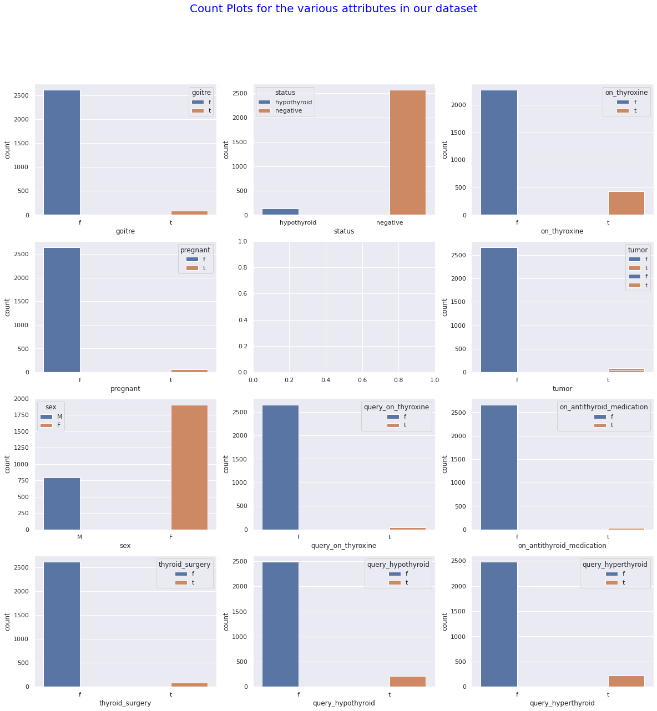
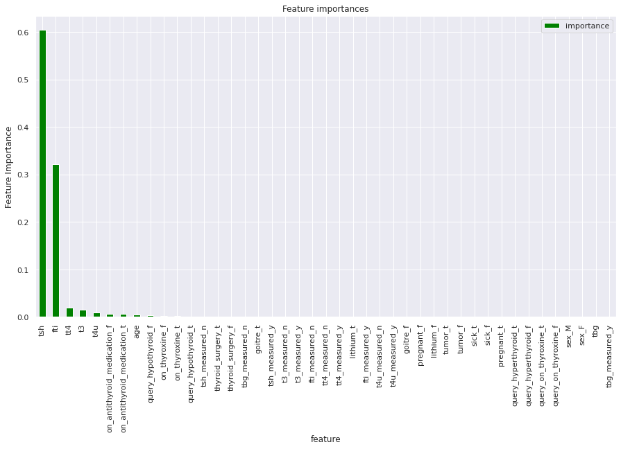

# Nairobi Hospital
Nairobi Hospital is among the most reputable private hosiptal in Kenya.It specializes in the treatment of many diseases, among them is hypothyroidism, which is a common condition where the thyroid doesn't create and release enough thyroid hormone into your bloodstream. This makes your metabolism slow down. Also called underactive thyroid, hypothyroidism can make you feel tired, gain weight and be unable to tolerate cold temperatures.
# Specifying the Data Analytic Question
This is an analysis to determine whether or not the patient's symptoms indicate that the patient has hypothyroid. Nairobi Hospital conducted a clinical camp to test for hypothyroidism. The data collected focused on Thyroid patients.
# Defining the Metric of Success
The metric of success for this project is to build a model that can predic whether or not the patient's symptoms indicate that the patient has hypothyroid. The accuracy level of the prediction model should be atleast 95% to be termed as a good model.
# Recording the Experimental Data
For this project, I will perform the following actions:

1.Reading the data.

2.Checking the data.

3.Tidyingthe datasets Analysis. For the cleaning part, I will check for outliers, anomalies, missing values,checking for duplicates,dropping unnecessary columns and changing the column names into lowercase for uniformity and stripping off whitespaces and dashes.

4.I will the perform EDA (Univariate,Bivariate, and Multivariate).

5.Performing Predictive Anaysis using:

1. Decision trees:Random forests, Ada boosted trees, and gradient boosted trees.

2. SVM: Apply Polynomial, linear and rbf kernel function to build your SVM model and then evaluate their performance and pick the kernel that performs the best. Remember to tune your parameters to improve the performance of your model. To make your life easier, make sure to visualize the models you've created. Use any two features to build the models for this step
  
6.Challenge your solution by providing insights on how you can make improvements in model improvement.

# Exploratory Data Analysis

## Univariate

The image below shows the univariate analysis of various variables:

## Bivariate

The images below shows the bivariare analysis of various variables:

.png)

Heatmap showing the correlation of all the variables:

.png)

## Feature Importance in Random Forest

## Feature Importance in Ada Boosting Trees

## Feature Importance in Gradient Boosting Trees

